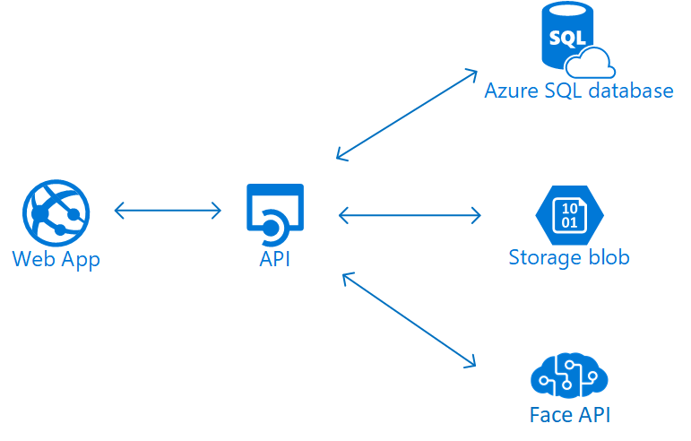

Profile Manager
---------------

This example **Profile Manager** application uses Azure managed services such as App Service, Azure SQL, Azure Storage, and Cognitive Services. It consists of a backend API, which services HTTP(S) requests from a front-end web application. In this example, both the web application and backend API are hosted in the same Azure Web App service for convenience, but they could be hosted separately. The backend API could also serve other clients such as a mobile application.



To deploy the application you need:

1. Azure Web App
2. Azure SQL Database
3. Azure BLOB Storage account
4. Azure Cognitive Services Face API endpoint and API key

Parameters can be provided in the `appsettings.json` file or in the app settings on the web app. Here is the structure for the `appsettins.json` file:

```json
{
  "CogSvcEndpoint": "https://westus.api.cognitive.microsoft.com/",
  "FaceApiKey": "SECRET-API-KEY",
  "ConnectionStrings": {
    "StorageConnectionString": "SECRET-STORAGE-CONNECTION-STRING",
    "SqlDbConnectionString": "SECRET-SQL-DB-CONNECTION-STRING"
  }
}
```